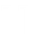
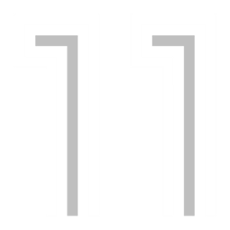
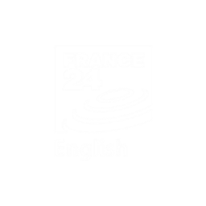
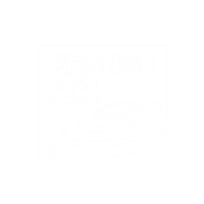

# Logos with names

*For optimal visibility of transparent logos, enable dark mode.*

| 

 | 

 | 

 | 

 | 

 |
|:---:|:---:|:---:|:---:|:---:|
| 
24kitchen
 | 
24kitchen-bw
 | 
24kitchen-gray
 | 
abolatv
 | 
abolatv-bw
 |
| 

 | 

 | 

 | 

 | 

 |
| 
abolatv-gray
 | 
afromusic
 | 
afromusic-gray
 | 
aljazeera
 | 
aljazeera-bw
 |
| 

 | 

 | 

 | 

 | 

 |
| 
aljazeera-gray
 | 
almalusa
 | 
almalusa-gray
 | 
amc
 | 
amc-bw
 |
| 

 | 

 | 

 | 

 | 

 |
| 
amc-gray
 | 
amcbreak
 | 
amcbreak-bw
 | 
amcbreak-gray
 | 
amccrime
 |
| 

 | 

 | 

 | 

 | 

 |
| 
amccrime-bw
 | 
amccrime-gray
 | 
arirang
 | 
arirang-bw
 | 
arirang-gray
 |
| 

 | 

 | 

 | 

 | 

 |
| 
artv
 | 
artv-gray
 | 
axn
 | 
axn-bw
 | 
axn-gray
 |
| 

 | 

 | 

 | 

 | 

 |
| 
axnmovies
 | 
axnmovies-bw
 | 
axnmovies-gray
 | 
axnwhite
 | 
axnwhite-bw
 |
| 

 | 

 | 

 | 

 | 

 |
| 
axnwhite-gray
 | 
babytv
 | 
babytv-gray
 | 
bbcworldnews
 | 
bbcworldnews-gray
 |
| 

 | 

 | 

 | 

 | 

 |
| 
benficatv
 | 
benficatv-bw
 | 
benficatv-gray
 | 
bloomberg
 | 
bloomberg-bw
 |
| 

 | 

 | 

 | 

 | 

 |
| 
bloomberg-gray
 | 
cacaepesca
 | 
cacaepesca-bw
 | 
cacaepesca-gray
 | 
canal11
 |
| 

 | 

 | 

 | 

 | 

 |
| 
canal11-bw
 | 
canal11-gray
 | 
canal180
 | 
canalhistoria
 | 
canalhistoria-bw
 |
| 

 | 

 | 

 | 

 | 

 |
| 
canalhistoria-gray
 | 
canalhollywood
 | 
canalhollywood-bw
 | 
canalhollywood-gray
 | 
canalpanda
 |
| 

 | 

 | 

 | 

 | 

 |
| 
canalpanda-bw
 | 
canalpanda-gray
 | 
canalq
 | 
canalq-gray
 | 
cancaonova
 |
| 

 | 

 | 

 | 

 | 

 |
| 
cancaonova-bw
 | 
cancaonova-gray
 | 
cartoonito
 | 
cartoonito-bw
 | 
cartoonito-gray
 |
| 

 | 

 | 

 | 

 | 

 |
| 
cartoonnetwork
 | 
cartoonnetwork-bw
 | 
cartoonnetwork-gray
 | 
casaecozinha
 | 
casaecozinha-bw
 |
| 

 | 

 | 

 | 

 | 

 |
| 
casaecozinha-gray
 | 
cazavision
 | 
cazavision-bw
 | 
cazavision-gray
 | 
cinemundo
 |
| 

 | 

 | 

 | 

 | 

 |
| 
cinemundo-bw
 | 
cinemundo-gray
 | 
cmtv
 | 
cmtv-bw
 | 
cmtv-gray
 |
| 

 | 

 | 

 | 

 | 

 |
| 
cnn
 | 
cnn-bw
 | 
cnn-gray
 | 
cnnportugal
 | 
cnnportugal-bw
 |
| 

 | 

 | 

 | 

 | 

 |
| 
cnnportugal-gray
 | 
combate
 | 
combate-bw
 | 
combate-gray
 | 
dazn1
 |
| 

 | 

 | 

 | 

 | 

 |
| 
dazn1-bw
 | 
dazn1-gray
 | 
dazn2
 | 
dazn2-bw
 | 
dazn2-gray
 |
| 

 | 

 | 

 | 

 | 

 |
| 
dazn3
 | 
dazn3-bw
 | 
dazn3-gray
 | 
dazn4
 | 
dazn4-bw
 |
| 

 | 

 | 

 | 

 | 

 |
| 
dazn4-gray
 | 
dazn5
 | 
dazn5-bw
 | 
dazn5-gray
 | 
dazn6
 |
| 

 | 

 | 

 | 

 | 

 |
| 
dazn6-bw
 | 
dazn6-gray
 | 
discoverychannel
 | 
discoverychannel-bw
 | 
discoverychannel-gray
 |
| 

 | 

 | 

 | 

 | 

 |
| 
disneychannel
 | 
disneychannel-bw
 | 
disneychannel-gray
 | 
disneyjunior
 | 
disneyjunior-bw
 |
| 

 | 

 | 

 | 

 | 

 |
| 
disneyjunior-gray
 | 
dizi
 | 
dizi-bw
 | 
dizi-gray
 | 
docubox
 |
| 

 | 

 | 

 | 

 | 

 |
| 
docubox-bw
 | 
docubox-gray
 | 
dogtv
 | 
dogtv-bw
 | 
dogtv-gray
 |
| 

 | 

 | 

 | 

 | 

 |
| 
dw
 | 
dw-bw
 | 
dw-gray
 | 
eentertainement
 | 
eentertainement-bw
 |
| 

 | 

 | 

 | 

 | 

 |
| 
eentertainement-gray
 | 
eltorotv
 | 
eltorotv-bw
 | 
eltorotv-gray
 | 
euronews
 |
| 

 | 

 | 

 | 

 | 

 |
| 
euronews-bw
 | 
euronews-gray
 | 
eurosport1
 | 
eurosport1-bw
 | 
eurosport1-gray
 |
| 

 | 

 | 

 | 

 | 

 |
| 
eurosport2
 | 
eurosport2-bw
 | 
eurosport2-gray
 | 
fashiontv
 | 
fashiontv-bw
 |
| 

 | 

 | 

 | 

 | 

 |
| 
fashiontv-gray
 | 
fifa+
 | 
fifa+-bw
 | 
fifa+-gray
 | 
fightnetwork
 |
| 

 | 

 | 

 | 

 | 

 |
| 
fightnetwork-bw
 | 
fightnetwork-gray
 | 
fightsports
 | 
fightsports-bw
 | 
fightsports-gray
 |
| 

 | 

 | 

 | 

 | 

 |
| 
foodnetwork
 | 
foodnetwork-bw
 | 
foodnetwork-gray
 | 
fptvwhite
 | 
fptvwhite-bw
 |
| 

 | 

 | 

 | 

 | 

 |
| 
fptvwhite-gray
 | 
france24english
 | 
france24english-bw
 | 
france24english-gray
 | 
france24francais
 |
| 

 | 

 | 

 | 

 | 

 |
| 
france24francais-bw
 | 
france24francais-gray
 | 
freedom-bw
 | 
fueltv
 | 
fueltv-bw
 |
| 

 | 

 | 

 | 

 | 

 |
| 
fueltv-gray
 | 
gametoon
 | 
gametoon-bw
 | 
gametoon-gray
 | 
globo
 |
| 

 | 

 | 

 | 

 | 

 |
| 
globo-bw
 | 
globo-gray
 | 
globointernacional
 | 
globointernacional-bw
 | 
globointernacional-gray
 |
| 

 | 

 | 

 | 

 | 

 |
| 
globonews
 | 
globonews-bw
 | 
globonews-gray
 | 
hgtv
 | 
hgtv-bw
 |
| 

 | 

 | 

 | 

 | 

 |
| 
hgtv-gray
 | 
iconcerts
 | 
iconcerts-bw
 | 
iconcerts-gray
 | 
insighttv
 |
| 

 | 

 | 

 | 

 | 

 |
| 
insighttv-bw
 | 
insighttv-gray
 | 
investigationdiscovery
 | 
investigationdiscovery-bw
 | 
investigationdiscovery-gray
 |
| 

 | 

 | 

 | 

 | 

 |
| 
kuriakostv
 | 
kuriakostv-bw
 | 
kuriakostv-gray
 | 
localvisao
 | 
localvisao-gray
 |
| 

 | 

 | 

 | 

 | 

 |
| 
mcmpop
 | 
mcmpop-bw
 | 
mcmpop-gray
 | 
mcmtop
 | 
mcmtop-bw
 |
| 

 | 

 | 

 | 

 | 

 |
| 
mcmtop-gray
 | 
mezzo
 | 
mezzo-bw
 | 
mezzo-gray
 | 
mezzolive
 |
| 

 | 

 | 

 | 

 | 

 |
| 
motorvision
 | 
motorvision-bw
 | 
motorvision-gray
 | 
mtv
 | 
mtv-bw
 |
| 

 | 

 | 

 | 

 | 

 |
| 
mtv-gray
 | 
nationalgeographic
 | 
nationalgeographic-bw
 | 
nationalgeographic-gray
 | 
nationalgeographicwild
 |
| 

 | 

 | 

 | 

 | 

 |
| 
nationalgeographicwild-bw
 | 
nationalgeographicwild-gray
 | 
nauticalchannel
 | 
nauticalchannel-bw
 | 
nauticalchannel-gray
 |
| 

 | 

 | 

 | 

 | 

 |
| 
nbatv
 | 
nbatv-bw
 | 
nbatv-gray
 | 
newsnow
 | 
newsnow-bw
 |
| 

 | 

 | 

 | 

 | 

 |
| 
newsnow-gray
 | 
nickelodeon
 | 
nickelodeon-bw
 | 
nickelodeon-gray
 | 
nickjr
 |
| 

 | 

 | 

 | 

 | 

 |
| 
nickjr-bw
 | 
nickjr-gray
 | 
nosstudios
 | 
nosstudios-bw
 | 
nosstudios-gray
 |
| 

 | 

 | 

 | 

 | 

 |
| 
odisseia
 | 
odisseia-bw
 | 
odisseia-gray
 | 
onetoro
 | 
onetoro-bw
 |
| 

 | 

 | 

 | 

 | 

 |
| 
onetoro-gray
 | 
pandakids
 | 
pandakids-bw
 | 
pandakids-gray
 | 
portocanal
 |
| 

 | 

 | 

 | 

 | 

 |
| 
portocanal-bw
 | 
portocanal-gray
 | 
protv
 | 
protv-bw
 | 
protv-gray
 |
| 

 | 

 | 

 | 

 | 

 |
| 
record
 | 
record-gray
 | 
rtl
 | 
rtl-bw
 | 
rtl-gray
 |
| 

 | 

 | 

 | 

 | 

 |
| 
rtp1
 | 
rtp1-bw
 | 
rtp1-gray
 | 
rtp2
 | 
rtp2-bw
 |
| 

 | 

 | 

 | 

 | 

 |
| 
rtp2-gray
 | 
rtpacores
 | 
rtpacores-bw
 | 
rtpacores-gray
 | 
rtpafrica
 |
| 

 | 

 | 

 | 

 | 

 |
| 
rtpafrica-bw
 | 
rtpafrica-gray
 | 
rtpmadeira
 | 
rtpmadeira-bw
 | 
rtpmadeira-gray
 |
| 

 | 

 | 

 | 

 | 

 |
| 
rtpmemoria
 | 
rtpmemoria-bw
 | 
rtpmemoria-gray
 | 
rtpmundo
 | 
rtpmundo-bw
 |
| 

 | 

 | 

 | 

 | 

 |
| 
rtpmundo-gray
 | 
rtpnoticias
 | 
rtpnoticias-bw
 | 
rtpnoticias-gray
 | 
s+
 |
| 

 | 

 | 

 | 

 | 

 |
| 
s+-bw
 | 
s+-gray
 | 
sic
 | 
sic-gray
 | 
sicaltadefinicao
 |
| 

 | 

 | 

 | 

 | 

 |
| 
sicaltadefinicao-gray
 | 
siccaras
 | 
siccaras-bw
 | 
siccaras-gray
 | 
sicinternacional
 |
| 

 | 

 | 

 | 

 | 

 |
| 
sicinternacional-gray
 | 
sick
 | 
sick-gray
 | 
sicmulher
 | 
sicmulher-bw
 |
| 

 | 

 | 

 | 

 | 

 |
| 
sicmulher-gray
 | 
sicnoticias
 | 
sicnoticias-bw
 | 
sicnoticias-gray
 | 
sicnovelas
 |
| 

 | 

 | 

 | 

 | 

 |
| 
sicnovelas-bw
 | 
sicnovelas-gray
 | 
sicradical
 | 
sicradical-bw
 | 
sicradical-gray
 |
| 

 | 

 | 

 | 

 | 

 |
| 
sicreplay
 | 
sicreplay-gray
 | 
skynews
 | 
skynews-bw
 | 
skynews-gray
 |
| 

 | 

 | 

 | 

 | 

 |
| 
sportingtv
 | 
sportingtv-bw
 | 
sportingtv-gray
 | 
sporttv+
 | 
sporttv+-bw
 |
| 

 | 

 | 

 | 

 | 

 |
| 
sporttv+-gray
 | 
sporttv1
 | 
sporttv1-bw
 | 
sporttv1-gray
 | 
sporttv2
 |
| 

 | 

 | 

 | 

 | 

 |
| 
sporttv2-bw
 | 
sporttv2-gray
 | 
sporttv3
 | 
sporttv3-bw
 | 
sporttv3-gray
 |
| 

 | 

 | 

 | 

 | 

 |
| 
sporttv4
 | 
sporttv4-bw
 | 
sporttv4-gray
 | 
sporttv5
 | 
sporttv5-bw
 |
| 

 | 

 | 

 | 

 | 

 |
| 
sporttv5-gray
 | 
sporttv6
 | 
sporttv6-bw
 | 
sporttv6-gray
 | 
sporttv7
 |
| 

 | 

 | 

 | 

 | 

 |
| 
sporttv7-bw
 | 
sporttv7-gray
 | 
sportvbr
 | 
sportvbr-bw
 | 
sportvbr-gray
 |
| 

 | 

 | 

 | 

 | 

 |
| 
starchannel
 | 
starchannel-bw
 | 
starchannel-gray
 | 
starcomedy
 | 
starcomedy-bw
 |
| 

 | 

 | 

 | 

 | 

 |
| 
starcomedy-gray
 | 
starcrime
 | 
starcrime-bw
 | 
starcrime-gray
 | 
starlife
 |
| 

 | 

 | 

 | 

 | 

 |
| 
starlife-bw
 | 
starlife-gray
 | 
starmovies
 | 
starmovies-bw
 | 
starmovies-gray
 |
| 

 | 

 | 

 | 

 | 

 |
| 
syfy
 | 
syfy-bw
 | 
syfy-gray
 | 
tcvi
 | 
tcvi-bw
 |
| 

 | 

 | 

 | 

 | 

 |
| 
tcvi-gray
 | 
tlc
 | 
tlc-bw
 | 
tlc-gray
 | 
tpai
 |
| 

 | 

 | 

 | 

 | 

 |
| 
tpai-bw
 | 
tpai-gray
 | 
tracebrasil
 | 
tracebrasil-gray
 | 
tracetoca
 |
| 

 | 

 | 

 | 

 | 

 |
| 
tracetoca-bw
 | 
tracetoca-gray
 | 
traceurban
 | 
traceurban-bw
 | 
traceurban-gray
 |
| 

 | 

 | 

 | 

 | 

 |
| 
travelchannel
 | 
travelchannel-bw
 | 
travelchannel-gray
 | 
tv5monde
 | 
tv5monde-bw
 |
| 

 | 

 | 

 | 

 | 

 |
| 
tv5monde-gray
 | 
tvcineaction
 | 
tvcineaction-bw
 | 
tvcineaction-gray
 | 
tvcineedition
 |
| 

 | 

 | 

 | 

 | 

 |
| 
tvcineedition-bw
 | 
tvcineedition-gray
 | 
tvcineemotion
 | 
tvcineemotion-bw
 | 
tvcineemotion-gray
 |
| 

 | 

 | 

 | 

 | 

 |
| 
tvcinetop
 | 
tvcinetop-bw
 | 
tvcinetop-gray
 | 
tvg
 | 
tvg-bw
 |
| 

 | 

 | 

 | 

 | 

 |
| 
tvg-gray
 | 
tvi
 | 
tvi-bw
 | 
tvi-gray
 | 
tviinternacional
 |
| 

 | 

 | 

 | 

 | 

 |
| 
tviinternacional-bw
 | 
tviinternacional-gray
 | 
tvireality
 | 
tvireality-bw
 | 
tvireality-gray
 |
| 

 | 

 | 

 | 

 | 

 |
| 
vintv
 | 
vintv-bw
 | 
vintv-gray
 | 
vmaistvi
 | 
vmaistvi-bw
 |
| 

 | 

 | 

 | 

 | 
&nbsp;
 |
| 
vmaistvi-gray
 | 
zapviva
 | 
zapviva-bw
 | 
zapviva-gray
 | 
&nbsp;
 |

